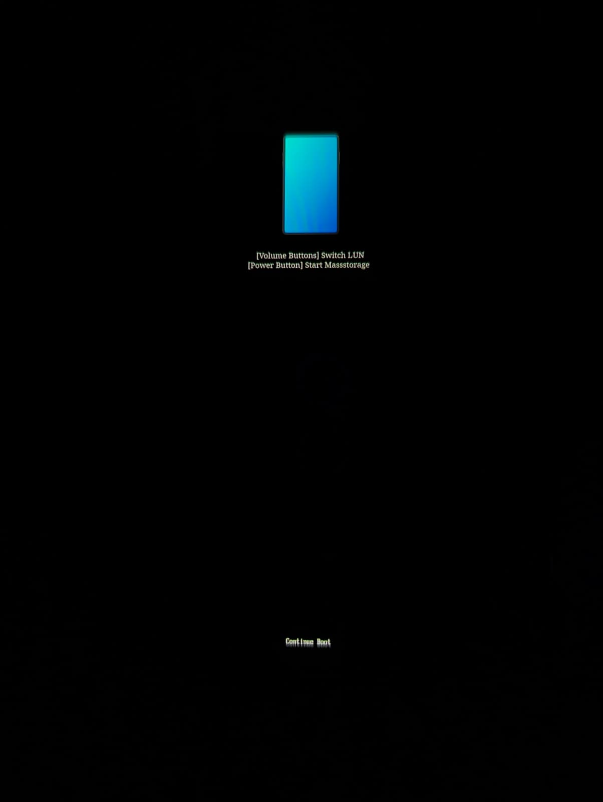

# Install Windows on Galaxy A52 4G

# JUST wait here and read this all before beginning !!!!!!

## Disclaimers

> [!WARNING]
> - If you see a warning and/or error during the process which is not specified in the guides, it is NOT normal then. Contact us on Discord if you see anything odd, but do not continue or proceed on your own, you will break things further.
> - Don't rerun the commands if you interrupt the process. You may break your partition table.
> - Do not run all commands at once. 
> - Do not commit *any* typo with *any* commands.
> - Be familiar with command line interfaces.
> - ALso Note that Samsung A52 4G doesnot have *ANY EDL FIREHOSE LOADER* so *PLEASE and PLEASE* be very careful as if things got wrong, you *Cannot* repair this device then without giving any money to third-party repair solutions
> - Users have already messed up their phone while fixing UFS and/or partitioning the device. So please be very very ultra careful

> [!IMPORTANT]
> **THIS WILL WIPE ALL YOUR ANDROID™ DATA**
>
> We don't take any responsibility for any damage done to your phone. By following this guide, you agree to take full responsibility of your actions. We have done some testing,
>
> but this is **STILL IN PREVIEW** and things can go wrong.
> Windows 11 os samsung a52q is unstable so please run at your own risk. dont daily drive it

**PLEASE READ AND BE SURE TO UNDERSTAND THE ENTIRE GUIDE BEFORE STARTING**

Before you begin installing windows on your A52, make sure you have the following things

## Prerequisties:
   - PC / Laptop with Windows (Recommended: Windows 10 or higher/ Any Linux distro like Ubuntu 24.0 or latest )
   - [ADB](https://developer.android.com/studio/releases/platform-tools#downloads)
   - [TWRP](https://twrp.me/samsung/samsunggalaxya52q.html)
   - Unlocked Bootloader ( [Unlock the Bootloader](../UnlockingBootloader.md) from here)
   - [UEFI Image](https://cdn.discordapp.com/attachments/1214286539593613344/1425171690089877635/Mu-a52q.img?ex=68e89851&is=68e746d1&hm=f10b087c98648d498cd1e3b4edab407c4190704de889639ae48902470d309151&)
   - install.wim from a Windows 11 24H2 ISO
   - [Parted](https://cdn.discordapp.com/attachments/1057409313381040261/1275435724195496048/parted?ex=68e85755&is=68e705d5&hm=5ac60912de2fbd785f2e83c9ecf1d613a49b486141d215013d2d0382f9685a6c&)
   - [GDisk](https://cdn.discordapp.com/attachments/1057409313381040261/1319684671486824478/gdisk?ex=68e87a60&is=68e728e0&hm=0a4e2dad4c8e716b8dcf06387149b984cbdb6bbec7bc2859fe939bc6e58a8de6&)
   - [A52q drivers](https://github.com/woa-a52s/Samsung-A52s-5G-Releases/releases/latest)

Table of Contents:
   * [Files/Tools Needed](#Prerequisties)
* [Steps](#steps)
   * [Unlocking the Bootloader](#unlocking-the-bootloader)
   * [Flashing UEFI and TWRP](#flashing-uefi-and-twrp)
   * [Backing up Important Partitions](#backing-up-important-partitions)
   * [Fixing UFS GPTs and its LUNs](#fixing-ufs-gpts-and-its-luns)
   * [Partitioning](#partitioning)
   * [Activating Mass Storage Mode](#activating-mass-storage-mode)
   * [Installing Windows](#installing-windows)
   * [Installing the drivers](#installing-the-drivers)
   * [Boot Windows](#boot-windows)
 

## Step-1
## Unlocking the Bootloader

If not already done, please first proceed with the [Unlocking the Bootloader](../UnlockingBootloader.md)) guide for Galaxy A52 4G. Come back once you're done. If you already followed this guide, please skip the unlocking section.

## Step-2
## Flashing UEFI and TWRP

If not already done, please first proceed with the [Flashing TWRP and UEFI](../Flash-UEFI-TWRP.md) guide for Galaxy A52 4G. Come back once you're done.

## Step-3
## Backing up Important Partitions

It is highly EXTREMELYT recommended to [backup important partitions](../BackingUpImportantPartitions.md) that are unique to each device before proceeding with the guide.

Please follow the provided guide, then come back once you're done.

## Step-4
## Fixing UFS GPTs and its LUNs

> [!CAUTION]
> This Section will Brick your Device if not Followed correctly!
> 
> Please carefully read the entire DISCLAMER section before continuing

Before Installing windows, we have to first fix the GPT partition table of all LUNs of UFS storage drive of the SAMSUNG A52 4G

Samsung sets their UFS (the LUN 0) on Snapdragon Devices (including A52 4G) Offline which breaks Windows / Linux Boot, So you need to set it Online. <br>
Open Disk Manager on your PC and Find the Disk with way to many Partitions. <br>
Right Click the Disk and Press `Online`.


Now Windows set it to Online and it should now be one Large Unformated Partition. <br>
Whatever you do, ***Don't* Reboot your Device!** at all!! <br>
You need to Repair it now, install gdisk we provided you in the prerequisties section. <br>

Then transfer that gdisk binary to your phone. considering it in the downlaods folder:
```bash
# transfers to your samsung device
adb push C:\Users\your-username\Downloads\gdisk /cache/gdisk
```
Next, enter ADB shell using your computer cmd:
```cmd
adb shell
```

After that Run `gdisk` on the Samsung a52 using these Commands:
```bash
# Makes the File Executable
chmod 744 /cache/gdisk

# Runs "gdisk"
./cache/gdisk /dev/block/sda
```
Once you Executed the Commands you should see a GPT Corrupted Warning like this:


Run these Commands in gdisk to Repair your GPT, First Enter `r`, That will Enter the Recovery Options. <br>
Then Enter `c`, That will now Repair your GPT, Now just Enter `w` and Confirm with `y` to Write the Changes. <br>
After you ran all these Commands it should Exit, Once it did, Rerun the gdisk Command and check if everything is Fine now. <br>
If all Partitions are there after using `p`, Exit using `q` and Power Off your Device.
please make sure you see all partitions are there in your phone using `p`.<br>
Now lets fix all other LUNs so that Windows doesnt mess up with other LUNs.

## Fixing UFS LUNs

First download [Windows gdisk](https://sourceforge.net/projects/gptfdisk/files/gptfdisk/1.0.3/gdisk-binaries/gdisk-windows-1.0.3.zip/download)<br>
Then, just Extract the .zip File.<br>

To Repair the UFS LUNs you will need UEFI Image of A52q. <br>
Flash the UEFI Image from (#Step-2). <br>
Once you did that, Reboot your Device and then Hold Volume Down when you see the Project Silicium Logo to enter Mass Storage. <br>
If you did that Correctly, You should see a Blue Phone on your Device now:



At the Bottom of your Screen is some Text, Press the Volume Buttons until you see: `Current LUN: 0`. <br>
Once it says that, Press the Power Button to Confirm, Connect your Device now to your PC. <br>
Your PC should see a Large Disk with way to many Partitions in Disk Manager:


Get the Disk Number of the new Disk, In the Picture it's `2`. <br>
Now open a Command Prompt Window as Admin in the Directory where you Extracted the gdisk .zip File. <br>
After that, Just run gdisk on the new Disk:
```cmd
.\gdisk.exe 2:
```

You should now see Text like in this Pictures:


If you see the GPT Corrupted Warning in your Command Prompt like in the second Picture, then you need to Repair the GPT Table. <br>

To do that, Enter `r`, That will enter the Recovery Options. <br>
Once you did that, Enter `c` and confirm with `y`, That will repair the GPT Table. <br>
Now just Save the Changes by entering `w` and confirming with `y`. <br>
It will throw you out of gdisk, Reenter it by using the same Command as before, You should now not see the Warning anymore.

Otherwise you can Skip this Step to repair the GPT Table.


After you Fixed your GPT Table, Check for other Problems by entering `v`. <br>
Only these 2 Problems matter:
```
NOTE: These are no the Entire Messages.

Problem 1: ----------------------------------------------------------------------
Using 'j' on the experts' menu can adjust this gap.
---------------------------------------------------------------------------------

Problem 2: ----------------------------------------------------------------------
Using 'k' on the experts' menu can adjust this gap.
---------------------------------------------------------------------------------
```

If you don't see any of these 2 Problems, You can skip this LUN, Enter `q` to Exit and Press Volume Up on your Device and Select the next LUN. <br>
Then follow this Section for the next LUN, If you see atleast one of these 2 Problems, You need to Fix them. <br>

If you see the Problem in the First Box, Do these Things to Fix it. <br>
First, Enter the Expert Menu by entering `x`, Then enter `j`, It will ask you for a Value, Just Press Enter there. <br>
If you see the Problem in the second Box too, Run `k` in the Expert Menu, It will also ask you for a Value, Press Enter there again. <br>
Now all Problems are Fixed.

Save the Changes by entering `w` and confirming with `y`.

## Verify Changes

Now reopen gdisk again and Check if you see Corrupted GPT Warning:


If you do, Enter `r`, then enter `c` and confirm with `y`, That Fixes the GPT Table, <br>
Now save the Changes again using `w` and confirming with `y`.

Reopen gdisk again to Check if the Corrupted GPT Warning is Gone and if the 2 Problems in `v` are Gone. <br>
If they are, Exit gdisk with `q` and Press Volume Up on your Device, Select the next LUN and Follow [Repairing UFS LUNs](#repairing-ufs-luns) Section again and again upto LUN5.

Once you're unable to Select the next LUN on your Device after pressing volume down button, that means you Reached the End, Disconnect your Device and Select `Power Off`.

# Step-5
## Partition UFS

***⚠️ In this Section of the Guide you can easly brick your Device! ⚠️***

Boot into TWRP recovery and unmount `userdata`, then open Command Promt on your PC / Laptop and enter ADB Shell. <br />
Once in ADB Shell create a directory called `worksapce` in `/`:
```
mkdir /workspace/
```
Then push parted from prerequisties with `adb push` into the workspace folder:
```
adb push parted gdisk /workspace/
```
After you copied parted to workspace make it executeable and run parted:
```
chmod 744 parted gdisk
./parted /dev/block/sda
```
Once you executed parted print the partition table:
```
(parted) print
```
Find userdata in output and note the Number, Start and End Address. <br />
Example:
```
# NOTE: Don't use these Values it just an Example!
Number  Start   End     Size    File system  Name             Flags
38      141GB   241GB   100GB                userdata
```
Once you noted the Number, Start and End Address delete userdata and create is again but smaller: <br />
```
# Deleting userdata will wipe all your data in Android!
(parted) rm <Number>
(parted) mkpart userdata ext4 <Start> <End / 2>
```
After shrinking userdata We can move on to creating the other Partitions:
```
(parted) mkpart esp fat32 <End / 2> <End / 2 + 512MB>
(parted) mkpart win ntfs <End / 2 + 512MB> <End>
```
Now we set esp to active by running: `set <Number> esp on`. <br />
Once that is done we exit parted and reboot again to recovery:
```
(parted) quit
reboot recovery
```
Now from TWRP recovery, format the partitions via ADB shell:
```
adb shell
mke2fs -t ext4 /dev/block/by-name/userdata        # Userdata
mkfs.fat -F32 -s1 /dev/block/by-name/esp          # ESP
mkfs.ntfs -f /dev/block/by-name/win               # Windows
```
If formating userdata gives a error reboot again to recovery and format userdata in the TWRP GUI. <br />

***⚠️ End of the Dangerous Section! ⚠️***

Now that you are done with the most important thing, lets go and install windows 11 24h2 on it.

# Step-6
## Installing Windows
## Windows Image download (Step 6.1)

[UUP Dump](https://uupdump.net/) is recommended to get a Windows 10/11 ARM64 ISO Image. <br /> 
Choose a 24H2 Build and select all Options you prefer. <br />
After that download the zip File and extract it on your PC / Laptop. (The Path should not contain any spaces) <br />
Then Open the extracted Folder and run the Build script, wait once it is finished. (Some AntiVirus Programs stop the Build so disbale windows antivirus on your pc) <br />
A ISO will appear in the Folder, open the ISO File and extract the install.wim from `sources` and place it somewhere, where you can reach it.

## Windows image install (Step 6.2)
Reboot your a52 to UEFI image and press volume down to enter Mass Storage mode
Then connect your Device to the PC / Laptop and find the Windows and esp partition. <br />
Open diskpart in Command Promt and Find all needed Partitions:
```
# NOTE: Most likely, your system itself will assign a letter to the win partition.
DISKPART> lis dis
# you can findout the Device ID by looking at the Sizes you may regonize your Device Internal Storage Size.
DISKPART> sel dis <Device ID>
DISKPART> lis par
DISKPART> sel par <Number + 1>
# Use a other Letter if "X" is not availbe.
DISKPART> assign letter X
DISKPART> sel par <Number + 2>
# Use a other Letter if "R" is not availbe.
DISKPART> assign letter R
DISKPART> exit
```
If you get eror like "the drive is removable so you cannot assign letter to ESP partition" something like that, then install diskgenious software and then mount the ESP partition of a52 to your pc with `X` or `any letter` via disk genius software.

Now we will apply install.wim to win ntfs partition using dism:
```
# R: Is what we assigned to the win partition in the diskpart, replace the letter if you used another letter for your win partition.
dism /apply-image /ImageFile:<Path to install.wim> /index:1 /ApplyDir:R:\
```
After that we need to create the Boot Files other wise our UEFI won't regonise Windows:
```
# R: and X: Is what we assigned fo Fat32 ESP partition in the diskpart, replace the letter if you used another letter.
bcdboot R:\Windows /s X: /f UEFI
```
## Configure BCD (Step 6.3)

Recovery mode of windows for phones is very dangerous and when you enter that, it will screw all of your phone's partition adn will easily brick your a52 or any mobile device. a system can boot into recovery mode via 2 methods. Either via 3 times failed boot and automatic recovery mode or via manually so we can disable that via BCD edit. But after BCD edit, we will also manually delete the WinRE binary which will permanently disable windows recovery on your phone.<br>

To do that:<br>
cd into the EFI Partition of your a52 and edit some BCD Values:
```
# Start CMD as Admin if you can't access The ESP Partition.
# X: Is what we assinged to ESP partition in the diskpart or disk genius, replace the letter if you used another letter.
cd X:\EFI\Microsoft\Boot
bcdedit /store BCD /set "{default}" testsigning on
bcdedit /store BCD /set "{default}" nointegritychecks on
bcdedit /store BCD /set "{default}" recoveryenabled no
```
AFter that cd into Win partition of your a52:
```

# R: is what we assigned to win partition in diskpart, replace the letter if you used another letter.
cd R:\Windows\System32\Recovery
# and delete WinRE.wim file from here
del WinRE.wim
# if you dont find the file here, find the WinRE.wim in System32 folder everywhere and delete that (if you dont find that in Recovery folder for some reason)
```

## Apply Drivers (Step 6.4)
Now will have to apply Drivers to the windows on a52.<br>
First downalod this https://github.com/arminask/windows_samsung_platforms/archive/refs/heads/a52q.zip
